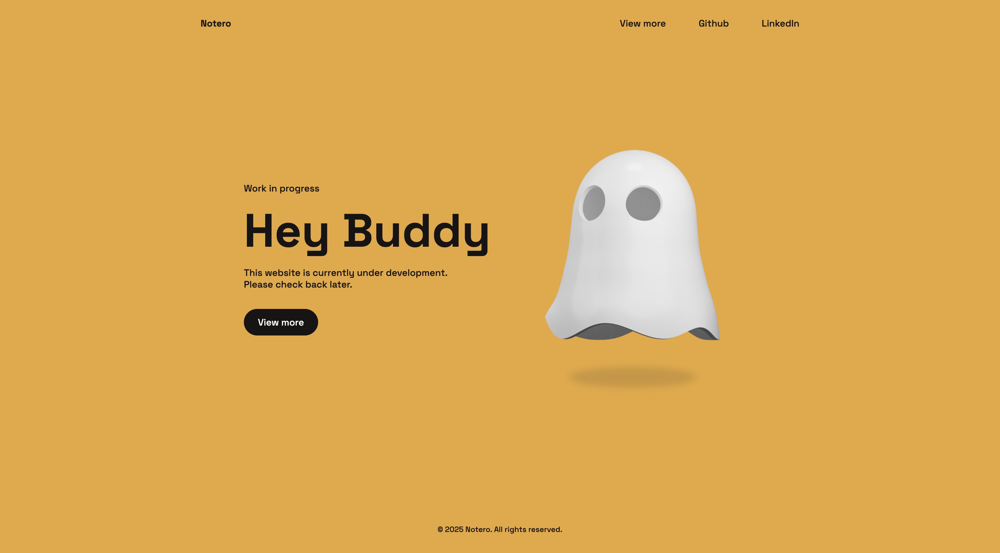

# Notero - Custom Error Page Template



## Overview
Notero is a modern, responsive error page template designed to provide an elegant solution for 404 errors and "under construction" notices. Perfect for maintaining a professional appearance while your website is in development or when visitors encounter missing pages.

## Features

### Visual Design
- Clean, minimalist aesthetic with ghost illustration
- Responsive layout for all device sizes
- Smooth animations and transitions
- Custom typography and spacing

### Components
- Modern navigation with mobile-friendly toggle
- Professional header and footer design
- Call-to-action buttons
- Social media/external links integration

### Technical Features
- **Auto Copyright Year Updater**: Dynamically displays the current year or year range in the footer
- ScrollReveal integration for smooth element animations
- Vanilla JavaScript with no dependencies
- Optimized for fast loading times

## Installation

1. Clone this repository or download the ZIP file
2. Upload all files to your web server
3. Customize the content to match your brand
4. Configure your server to display this page for 404 errors or as a temporary homepage

```shell script
git clone https://github.com/casparml/notero.git
```

## Usage

### Basic Setup
Simply modify the HTML content, update links, and replace the logo/images as needed.

### Customizing the Copyright Year
The auto-updating copyright year is handled by `copyright.js`. By default, it will show the current year, but you can specify a starting year:

```html
<footer>
  <span>© <span id="copyright"></span> Your Brand Name. All rights reserved.</span>
</footer>

<script src="includes/copyright.js"></script>
```

To change the starting year, open `includes/copyright.js` and update:

```javascript
document.addEventListener('DOMContentLoaded', () => updateCopyright(2022)); // Change to your desired start year
```

### Modifying Animations
The template uses ScrollReveal for animations. Modify `assets/js/style.js` to adjust animation settings.

## Browser Support
- Chrome, Firefox, Safari, Edge (latest versions)
- IE 11+ (basic support)

## Dependencies
- BoxIcons for icon fonts
- ScrollReveal for scroll animations

## License
MIT License - See LICENSE file for details.

## Author
Caspar Landman - [GitHub](https://github.com/casparml/) | [Website](https://www.casparlandman.com/) | [LinkedIn](https://www.linkedin.com/in/casparlandman/)

---

Feel free to use and modify this template for your projects. If you find it helpful, consider giving it a star on GitHub!